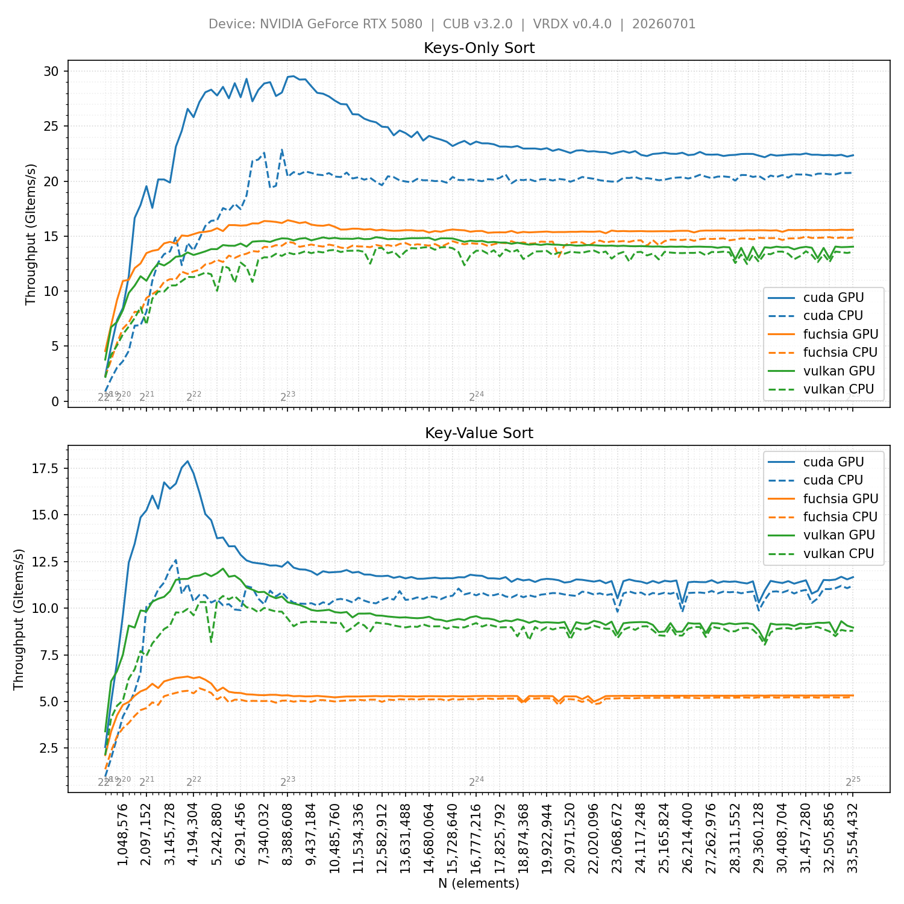

# vulkan_radix_sort

Vulkan implementation of radix sort.

Reduce-then-scan GPU radix sort algorithm is implemented.
As a header-only Vulkan library, it can be easily integrated into any Vulkan-based project without additional dependencies, making it suitable for applications such as 3D Gaussian Splatting rendering.

> **Note:** As of January 2025, this library was competitive with CUB Reduce-then-Scan radix sort.
> However, benchmarking in April 2026 against CUDA 13.2 and CUB v3.2.0 (which now defaults to Onesweep) shows CUB is faster: 2.1× for keys-only (10.66 vs 22.40 GItems/s) and 1.3× for key-value (9.04 vs 11.68 GItems/s) at N = 2^25.
> 
> Nevertheless, it is a practical choice for Vulkan-based applications requiring fast sorting, such as 3D Gaussian Splatting.


## Change History
- `v0.3.0`
  - Benchmark sweeps N linearly from 2^18 to 2^25 (128 steps), measuring both keys-only and key-value sort.
  - Benchmark outputs CSV with GPU and CPU wall-clock throughput per (N, sort type).
  - Added `tools/plot.py` for plotting benchmark results with matplotlib.
  - Header generation automated via `src/vk_radix_sort.h.in` template and `tools/generate_header.py`.
- `v0.2.2`
  - Use `minStorageBufferOffsetAlignment` instead of fixed `16` (@hypengw)
- `v0.2.1`
  - `Volk` is optional. A User can control which vulkan header to load with `VRDX_USE_VOLK` definition.
- `v0.2.0`
  - Single-file header-only library.
  - Requires `VulkanSDK>=1.4` to use push descriptor.
  - Requires `Volk`.
- `v0.1.0`
  - Use `VK_KHR_push_descriptor` instead of `VK_KHR_buffer_device_address`
    - Not to use vulkan-specific language in shader codes.
    - Buffers no longer need to have `VK_BUFFER_USAGE_SHADER_DEVICE_ADDRESS_BIT` when created.
    - Buffers offsets must be multiple of `minStorageBufferOffsetAlignment` (`16` in most cases).
    - Users of previous version need to update codes for device creation accordingly.
  - Migrate from `GLSL` to `Slang` shader language
    - For extensibility to other graphics APIs.
- `v0.0.0`
  - First publish.


## Requirements
- `VulkanSDK>=1.4.328.1`
  - Download from https://vulkan.lunarg.com/ and follow install instruction.
  - `slangc` executable is included in `VulkanSDK>=1.3.296.0`.
  - `push_descriptor` is available in `VulkanSDK>=1.4`, and especially for MacOS, `VulkanSDK>=1.4.328.1`.
- `cmake>=3.24`


## Build Benchmark
```bash
$ cmake . -B build
$ cmake --build build --config Release -j
```

## Test
```bash
$ ./build/Release/bench.exe <type> [output.csv]  # Windows
$ ./build/bench <type> [output.csv]              # Linux
$ ./build/Release/bench.exe vulkan results.csv
```
- type = one of cpu, vulkan, cuda
- Sweeps N linearly from 2^18 to 2^25 (128 steps), 1 warmup + 10 timed runs each
- Writes per-N median GPU and CPU wall-clock throughput to CSV

Plot results:
```bash
$ python tools/plot.py vulkan.csv cuda.csv results.png
```


### Test Environment
- Windows, NVIDIA GeForce RTX 5080.


### Benchmark Result

Test environment: Windows, NVIDIA GeForce RTX 5080, CUDA 13.2, CUB v3.2.0 (Onesweep default).

Median throughput at N = 2^25 (33,554,432 elements):

| Sort type | This library (Vulkan) | CUB Onesweep (CUDA) | Speed Ratio (CUB / Vulkan) |
|---|---|---|---|
| 32-bit keys only | 10.66 GItems/s | 22.40 GItems/s | 2.10× |
| 32-bit key-value | 9.04 GItems/s | 11.68 GItems/s | 1.29× |



## Use as a Library with CMake
1. Add subdirectory `vulkan_radix_sort`
    ```cmake
    add_subdirectory(path/to/vulkan_radix_sort)
    ```

1. Link to `vk_radix_sort` in your project (library, binary)
    ```cmake
    # To use `#include "volk.h"`
    target_compile_definitions(my_project PRIVATE VRDX_USE_VOLK)
    target_link_libraries(my_project PRIVATE volk::volk_headers vk_radix_sort)

    # Or just want `#include <vulkan/vulkan.h>`
    target_link_libraries(my_project PRIVATE Vulkan::Vulkan vk_radix_sort)
    ```

## Usage
This is a single header-only library.

1. In exactly one source file, define `VRDX_IMPLEMENTATION` before including `vk_radix_sort.h`.

1. Create `VkBuffer` for keys and values, with `VK_BUFFER_USAGE_STORAGE_BUFFER_BIT`.

1. Create `VrdxSorter`

    It creates shared resources: pipeline layouts, pipelines, etc.

    ```c++
    VrdxSorter sorter = VK_NULL_HANDLE;
    VrdxSorterCreateInfo sorterInfo = {};
    sorterInfo.physicalDevice = physicalDevice;
    sorterInfo.device = device;
    sorterInfo.pipelineCache = pipelineCache;
    vrdxCreateSorter(&sorterInfo, &sorter);
    ```

1. Create a temporary storage buffer for sort.

    ```c++
    // request storage buffer request
    VrdxSorterStorageRequirements requirements;
    // for key-only
    vrdxGetSorterStorageRequirements(sorter, elementCount, &requirements);
    // for key-value
    vrdxGetSorterKeyValueStorageRequirements(sorter, elementCount, &requirements);

    // create or reuse buffer
    VkBufferCreateInfo bufferInfo = {VK_STRUCTURE_TYPE_BUFFER_CREATE_INFO};
    bufferInfo.size = requirements.size;
    bufferInfo.usage = requirements.usage;
    // ...
    ```

1. Record sort commands.

    **Requirements**: buffer offsets must be multiple of `minStorageBufferOffsetAlignment` (usually `16`.)

    This command binds pipeline, pipeline layout, and push constants internally.

    So, users must not expect previously bound targets retain after the sort command.

    Users must add proper **execution barriers**.

    One can use buffer memory barrier, but in general, global barriers are more efficient than per-resource, according to [official synchronization examples](https://github.com/KhronosGroup/Vulkan-Docs/wiki/Synchronization-Examples#three-dispatches-first-dispatch-writes-to-one-storage-buffer-second-dispatch-writes-to-a-different-storage-buffer-third-dispatch-reads-both):

    > ... global memory barrier covers all resources. Generally considered more efficient to do a global memory barrier than per-resource barriers, per-resource barriers should usually be used for queue ownership transfers and image layout transitions - otherwise use global barriers.

    The sort command will read from key/value buffers (and elementCount buffer for indirect sort) in compute shader stage, and write to output key/value buffers in later compute shader stage.

    The second synchronization scope **before** sort command must include `COMPUTE_SHADER` stage (and `TRANSFER` for indirect sort) and `SHADER_READ` access (and `TRANSFER_READ` for indirect sort).

    The first synchronization scope **after** sort command must include `COMPUTE_SHADER` stage and `SHADER_WRITE` access.

    ```c++
    VkQueryPool queryPool;  // VK_NULL_HANDLE, or a valid timestamp query pool with size at least 15.

    // sort keys
    vrdxCmdSort(commandBuffer, sorter, elementCount,
                keysBuffer, 0,
                storageBuffer, 0,
                queryPool, 0);

    // sort keys with values
    vrdxCmdSortKeyValue(commandBuffer, sorter, elementCount,
                        keysBuffer, 0,
                        valuesBuffer, 0,
                        storageBuffer, 0,
                        queryPool, 0);

    // indirectBuffer contains elementCount, a single uint entry in GPU buffer.
    // maxElementCount is required for storage buffer offsets.
    // element count in the indirect buffer must not be greater than maxElementCount. Otherwise, undefined behavior.
    vrdxCmdSortKeyValueIndirect(commandBuffer, sorter, maxElementCount,
                                indirectBuffer, 0,
                                keysBuffer, 0,
                                valuesBuffer, 0,
                                storageBuffer, 0,
                                queryPool, 0);
    ```

## Development Guide
Run cmake build command once shader codes are changed.
```bash
$ cmake . -B build
$ cmake --build build --config Release -j
```

The cmake command runs slang compiler, generates header files into `src/generated/*.h`, and then automatically regenerates `include/vk_radix_sort.h` from `src/vk_radix_sort.h.in` via `tools/generate_header.py`.


## TODO
- [x] Use `VkPhysicalDeviceLimits` to get compute shader-related limits, such as `maxComputeWorkGroupSize` or `maxComputeSharedMemorySize`.
- [x] Increase allowed `maxElementCount` by allocating buffers properly.
- [x] Compare with CUB Reduce-then-Scan radix sort
- [x] Compare with CUB Onesweep radix sort
- [ ] Compare with VkRadixSort
- [ ] Compare with Fuchsia radix sort
- [ ] Find best `WORKGROUP_SIZE` and `PARTITION_DIVISION` for different devices.
- [x] Support for SubgroupSize=64.


## References
- https://github.com/b0nes164/GPUSorting : their CUDA kernel codes were very helpful when trying to catch the idea of how the algorithm works.


## Troubleshooting
- (NVIDIA GPU, Windows) Slow runtime after a few seconds.
  - Reason: NVidia driver adjust GPU/Memory clock.
    Open Performance Overlay (Alt+R), then you will see GPU/Memory Clock gets down.
  - Solution: change performance mode in control panel.
    
