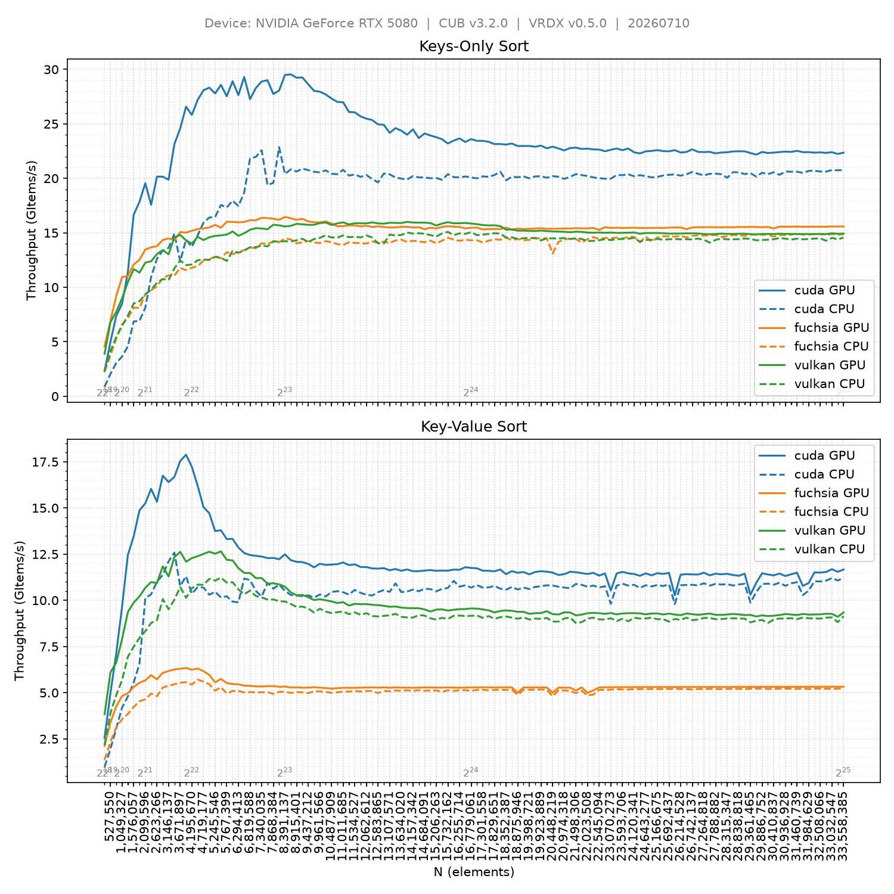
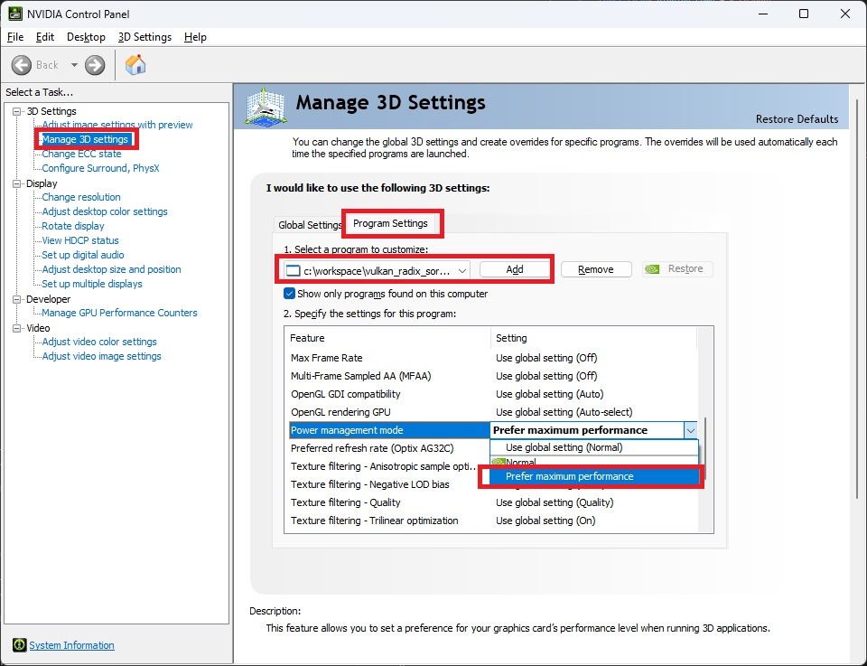

# vulkan_radix_sort

Reduce-then-scan GPU radix sort, implemented as a single-file header-only Vulkan library. No additional dependencies.

> **Note:** As of July 2026 (CUDA 13.2, CUB v3.2.0 Onesweep), CUB is faster by 1.50× on keys-only and 1.25× on key-value at N = 2^25. Still a practical choice for Vulkan-based workflows.

## Requirements

- `VulkanSDK >= 1.4.328.1` with `pushDescriptor` and `synchronization2` enabled
    - download from https://vulkan.lunarg.com/ (push descriptor requires >= 1.4; >= 1.4.328.1 for macOS)
- `cmake >= 3.24`
- Subgroup size of 32 or 64 lanes, and >= 20 KB of workgroup (`groupshared`) memory

## Build

`slangc` v2026.11 is downloaded automatically at configure time; to use the Vulkan SDK's instead, add `-DVRDX_SLANGC_FROM_SDK=ON`, e.g. `cmake -B build -DVRDX_SLANGC_FROM_SDK=ON`.

**Linux/macOS**
```bash
$ cmake -B build -DCMAKE_BUILD_TYPE=Release
$ cmake --build build -j
```

**Windows**
```bash
$ cmake -B build
$ cmake --build build --config Release -j
```

## Run Benchmark

**Linux/macOS**
```bash
$ ./build/bench <type> [-n N]... [-o output.csv] [--validation] [--timestamps] [--no-verify]
```

**Windows**
```bash
$ ./build/Release/bench.exe <type> [-n N]... [-o output.csv] [--validation] [--timestamps] [--no-verify]
```

- `type`: `cpu`, `vulkan`, `cuda`, `fuchsia`
- `-n N`: run only given N (repeatable); default sweeps 2^18–2^25 (128 steps, 1 warmup + 10 timed runs)
- `-o output.csv`: write median GPU/CPU throughput to CSV; omit for no CSV
- `--validation`: enable Vulkan validation layers (off by default)
- `--timestamps`: per-stage GPU timing (upsweep/spine/downsweep) via Vulkan query pool; adds overhead, Vulkan only
- `--no-verify`: skip the correctness check

For example:
```bash
$ ./build/bench vulkan -n 1048576 --validation --timestamps  # debug: validation layers + per-stage timing
$ ./build/bench vulkan -n 1048576                            # quick throughput check
```

Run every available backend and plot in one command:
```bash
$ python tools/bench_all.py
```
Saves each backend's CSV and a `results.png` plot to `benchmarks/<timestamp>/`.

Or save each backend's CSV manually, then plot:
```bash
$ ./build/bench vulkan -o vulkan.csv
$ ./build/bench cuda -o cuda.csv
$ ./build/bench fuchsia -o fuchsia.csv
$ python tools/plot.py vulkan.csv cuda.csv fuchsia.csv --output results.png
```

### Results

Test environment: Windows, NVIDIA GeForce RTX 5080, CUDA 13.2, CUB v3.2.0 (Onesweep default).

Median throughput at N = 2^25. Ratios relative to this library (> 1× means the competitor is faster).

| Sort type | This library (Vulkan) | Fuchsia (Vulkan) | CUB Onesweep (CUDA) |
|---|---|---|---|
| 32-bit keys only | 14.93 GItems/s | 15.59 GItems/s (1.04×) | 22.36 GItems/s (1.50×) |
| 32-bit key-value | 9.35 GItems/s | 5.32 GItems/s (0.57×) | 11.67 GItems/s (1.25×) |

Keys-only is now within 4% of [Fuchsia radix sort](https://github.com/juliusikkala/fuchsia_radix_sort) after the downsweep rework (splitting per-wave histogram accumulation from local offset lookup). Fuchsia is 1.76× slower on key-value — it packs pairs into a single 64-bit key, doubling memory traffic, while this library sorts the two buffers independently. Key-value still trails CUB by 1.25×, with room for a similar optimization.



## Integration

Integrate via CMake or by copying `include/vk_radix_sort.h` into your project.

### CMake

1. Add as a subdirectory:
    ```cmake
    add_subdirectory(path/to/vulkan_radix_sort)
    ```

    or via `FetchContent`:
    ```cmake
    include(FetchContent)
    FetchContent_Declare(
      vulkan_radix_sort
      GIT_REPOSITORY https://github.com/jaesung-cs/vulkan_radix_sort.git
      GIT_TAG        ...  # pin to a commit
    )
    FetchContent_MakeAvailable(vulkan_radix_sort)
    ```

1. Link to `vk_radix_sort`:
    ```cmake
    # With Volk
    target_link_libraries(my_project PRIVATE volk::volk_headers vk_radix_sort)

    # With standard Vulkan loader
    target_link_libraries(my_project PRIVATE Vulkan::Vulkan vk_radix_sort)
    ```

### Copy header

Copy `include/vk_radix_sort.h` into your project and include it directly.

## Usage

1. In exactly one source file, define `VRDX_IMPLEMENTATION` before including `vk_radix_sort.h`. Include `volk.h` first if using Volk.

    ```c++
    // With Volk
    #include "volk.h"
    #define VRDX_IMPLEMENTATION
    #include "vk_radix_sort.h"

    // With standard Vulkan headers
    #define VRDX_IMPLEMENTATION
    #include "vk_radix_sort.h"
    ```

1. Enable the required features when creating the `VkDevice`:

    ```c++
    VkPhysicalDeviceVulkan13Features features13 = {
        .sType = VK_STRUCTURE_TYPE_PHYSICAL_DEVICE_VULKAN_1_3_FEATURES,
        .synchronization2 = VK_TRUE,
    };

    VkPhysicalDeviceVulkan14Features features14 = {
        .sType = VK_STRUCTURE_TYPE_PHYSICAL_DEVICE_VULKAN_1_4_FEATURES,
        .pNext = &features13,
        .pushDescriptor = VK_TRUE,
    };

    VkDeviceCreateInfo deviceInfo = {
        .sType = VK_STRUCTURE_TYPE_DEVICE_CREATE_INFO,
        .pNext = &features14,
        ...
    };
    vkCreateDevice(physicalDevice, &deviceInfo, nullptr, &device);
    ```

1. Create `VkBuffer` for keys and values with `VK_BUFFER_USAGE_STORAGE_BUFFER_BIT`.

1. Create `VrdxSorter` (`vrdxCreateSorter`):

    ```c++
    VrdxSorter sorter = VK_NULL_HANDLE;
    VrdxSorterCreateInfo sorterInfo = {
        .physicalDevice = physicalDevice,
        .device         = device,
        .pipelineCache  = pipelineCache,  // optional, VK_NULL_HANDLE is valid
    };
    VkResult result = vrdxCreateSorter(&sorterInfo, &sorter);
    if (result != VK_SUCCESS) { /* handle error */ }
    ```

1. Allocate a temporary storage buffer:

    ```c++
    VrdxSorterStorageRequirements requirements;
    vrdxGetSorterStorageRequirements(sorter, elementCount, VRDX_SORT_MODE_KEYS_ONLY, &requirements);  // keys only
    vrdxGetSorterStorageRequirements(sorter, elementCount, VRDX_SORT_MODE_KEY_VALUE, &requirements);  // key-value

    VkBufferCreateInfo bufferInfo = {
        .sType = VK_STRUCTURE_TYPE_BUFFER_CREATE_INFO,
        .size  = requirements.size,
        .usage = requirements.usage,
        ...
    };
    ```

1. Record sort commands (`vrdxCmdSort`).

    Buffer offsets must be multiples of `minStorageBufferOffsetAlignment` (usually `16`).

    The sort rebinds pipeline, layout, and push constants — previously bound state is lost.

    Add **execution barriers** around the sort. Use global memory barriers rather than per-resource barriers ([Vulkan synchronization examples](https://github.com/KhronosGroup/Vulkan-Docs/wiki/Synchronization-Examples#three-dispatches-first-dispatch-writes-to-one-storage-buffer-second-dispatch-writes-to-a-different-storage-buffer-third-dispatch-reads-both)):

    - **Before** the sort: `COMPUTE_SHADER` stage (+ `TRANSFER` for indirect), `SHADER_READ` access (+ `TRANSFER_READ` for indirect).
    - **After** the sort: `COMPUTE_SHADER` stage, `SHADER_WRITE` access.

    ```c++
    // Barrier before the sort
    VkMemoryBarrier2 memoryBarrier = {
        .sType = VK_STRUCTURE_TYPE_MEMORY_BARRIER_2,
        .srcStageMask  = ...,
        .srcAccessMask = ...,
        .dstStageMask  = VK_PIPELINE_STAGE_2_COMPUTE_SHADER_BIT,  // | VK_PIPELINE_STAGE_2_TRANSFER_BIT for indirect
        .dstAccessMask = VK_ACCESS_2_SHADER_READ_BIT,             // | VK_ACCESS_2_TRANSFER_READ_BIT for indirect
    };

    VkDependencyInfo dependencyInfo = {
        .sType = VK_STRUCTURE_TYPE_DEPENDENCY_INFO,
        .memoryBarrierCount = 1,
        .pMemoryBarriers    = &memoryBarrier,
    };
    vkCmdPipelineBarrier2(commandBuffer, &dependencyInfo);

    // Sort. elementCount is exact for a direct sort, or an upper bound if elementCountBuffer is set
    // (actual count read from GPU, must not exceed elementCount).
    VrdxSortInfo info = {
        .elementCount       = elementCount,
        .elementCountBuffer = elementCountBuffer,  // omit for a direct sort
        .keysBuffer         = keysBuffer,
        .valuesBuffer       = valuesBuffer,        // omit for a keys-only sort
        .storageBuffer      = storageBuffer,
        ...  // offsets, queryPool, etc.; set explicitly if needed
    };
    vrdxCmdSort(commandBuffer, sorter, &info);

    // Barrier after the sort
    memoryBarrier = {
        .sType = VK_STRUCTURE_TYPE_MEMORY_BARRIER_2,
        .srcStageMask  = VK_PIPELINE_STAGE_2_COMPUTE_SHADER_BIT,
        .srcAccessMask = VK_ACCESS_2_SHADER_WRITE_BIT,
        .dstStageMask  = ...,
        .dstAccessMask = ...,
    };
    vkCmdPipelineBarrier2(commandBuffer, &dependencyInfo);
    ```

1. Destroy the `VrdxSorter` (`vrdxDestroySorter`) once no longer needed, e.g. before destroying the `VkDevice`. Ensure the device is idle (no in-flight command buffers referencing the sorter) first; `VK_NULL_HANDLE` is a safe no-op.

    ```c++
    vrdxDestroySorter(sorter);
    ```

## Development Guide

After modifying shaders or `src/vk_radix_sort.h.in`, run the cmake build — it compiles shaders with `slangc` into `src/generated/*.h`, then assembles `include/vk_radix_sort.h` from the template — and commit the regenerated header. Use the default build (without `-DVRDX_SLANGC_FROM_SDK=ON`) for reproducible output. Each generated file notes its `slangc` version:

```c
// Generated by slangc 2026.11
```

Bump `slangc` via `SLANG_VERSION` in `cmake/Slangc.cmake`; bump the library version via `VERSION` in `CMakeLists.txt`'s `project()` call. Rebuild and commit the regenerated header either way.

## Troubleshooting

**NVIDIA GPU (Windows): slow performance after a few seconds.**
- Cause: NVIDIA driver downgrades GPU/memory clock under sustained load. Check with the Performance Overlay (Alt+R).
- Fix: set performance mode to maximum in NVIDIA Control Panel.


