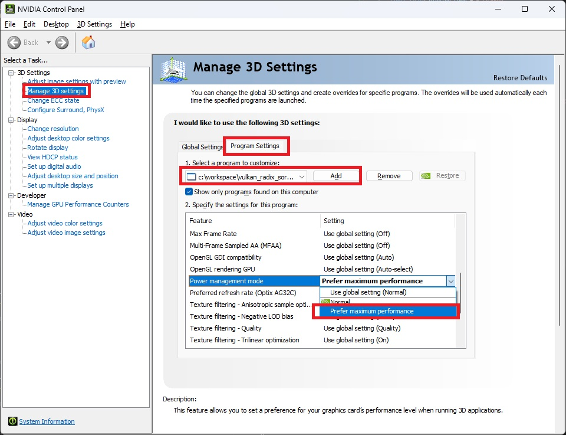

# vulkan_radix_sort
Vulkan implementation of radix sort.

State-of-the-art GPU radix sort algorithm, [Onesweep (Link to NVidia Research)](https://research.nvidia.com/publication/2022-06_onesweep-faster-least-significant-digit-radix-sort-gpus), is implemented.


## Requirements
- `VulkanSDK>=1.2`
  - Download from https://vulkan.lunarg.com/ and follow install instruction.
  - Requires several features available in `1.2`.
- `cmake>=3.15`


## Dependencies
- `VulkanMemoryAllocator`
  - To avoid conflict with parent project which also depends on a specific version of `VulkanMemoryAllocator`, this library only contains forward declaration.
  - The parent must contains a cpp file with `#define VMA_IMPLEMENTATION`.


## Build and Test
```bash
$ cmake . -B build
$ cmake --build build --config Release -j
$ ./build/Release/bench.exe  # Windows
$ ./build/bench  # Linux
```


### Test Environment
- Windows, NVIDIA GeForce RTX 4090.


## Use as a Library with CMake
- Add `VulkanMemoryAllocator` before addigng `vulkan_radix_sort`
    ```cmake
    add_subdirectory(path/to/VulkanMemoryAllocator)
    add_subdirectory(path/to/vulkan_radix_sort)
    ```

- Link to `vk_radix_sort` in your project (library, binary)
    ```cmake
    target_link_libraries(my_project PRIVATE Vulkan::Vulkan VulkanMemoryAllocator vk_radix_sort)
    ```

## Usage
1. When creating `VkDevice`, enable `VK_KHR_maintenance4` and `VK_KHR_synchronization2` device features.

1. Create `VrdxSorterLayout`

    It creates shared resources: descriptor layouts, pipeline layouts, pipelines, etc.

    ```c++
    VrdxSorterLayout sorterLayout = VK_NULL_HANDLE;
    VrdxSorterLayoutCreateInfo sorterLayoutInfo = {};
    sorterLayoutInfo.device = device_;
    sorterLayoutInfo.histogramWorkgroupSize = 1024;
    VrdxCreateSorterLayout(&sorterLayoutInfo, &sorterLayout);
    ```

1. Create `VrdxSorter` from `VrdxSorterLayout`.

    `VrdxSorter` owns a temporary storage buffer. The size of temporary storage is `2N` for key/value output, plus histogram.

    It also create its own descriptor pool and descriptor sets of size equal to `maxCommandsInFlight`.

    ```c++
    VrdxSorterCreateInfo sorterInfo = {};
    sorterInfo.allocator = allocator;  // VmaAllocator
    sorterInfo.sorterLayout = sorterLayout;
    sorterInfo.maxElementCount = 10000000;
    sorterInfo.maxCommandsInFlight = 2;
    vrdxCreateSorter(&sorterInfo, &sorter);
    ```

1. Record sort commands.

    This command binds pipeline, pipeline layout, descriptors, and push constants internally.

    So, users must not expect previously bound targets retain after the sort command.

    User must add proper barriers for key/value buffers.

    The second synchronization scope **before** sort command for **key/value buffer** must include `COMPUTE_SHADER` stage and `SHADER_READ` access.

    The second synchronization scope **before** sort command for **indirect buffer** must include `TRANSFER` stage and `TRANSFER_READ` access.

    The first synchronization scope **after** sort command for **key/value buffer** must include `COMPUTE_SHADER` stage and `SHADER_WRITE` access.

    The first synchronization scope **after** sort command for **indirect buffer** must include `TRANSFER` stage and `TRANSFER_READ` access.

    ```c++
    VkQueryPool queryPool;  // VK_NULL_HANDLE, or a valid timestamp query pool with size at least 8.
    vrdxCmdSort(commandBuffer, sorter, elementCount, keysBuffer, 0, queryPool, 0);
    vrdxCmdSortKeyValue(commandBuffer, sorter, elementCount, keysBuffer, 0, valuesBuffer, 0, queryPool, 0);

    // indirectBuffer contains elementCount, a single uint entry in GPU buffer.
    vrdxCmdSortKeyValueIndirect(commandBuffer, sorter, indirectBuffer, 0, keysBuffer, 0, valuesBuffer, 0, queryPool, 0);
    ```


## Current Limitations
- `maxElementCount` $\le$ 10000000.


## TODO
- [x] Use `VkPhysicalDeviceLimits` to get compute shader-related limits, such as `maxComputeWorkGroupSize` or `maxComputeSharedMemorySize`.
- [ ] Increase allowed `maxElementCount` by allocating buffers properly.
- [ ] Compare with CUB radix sort
- [ ] Compare with VkRadixSort


## References
- https://github.com/b0nes164/GPUSorting : their CUDA kernel codes were very helpful when trying to catch the idea of how the algorithm works.


## Troubleshooting
- (NVIDIA GPU, Windows) Slow runtime after a few seconds.
  - Reason: NVidia driver adjust GPU/Memory clock.
    Open Performance Overlay (Alt+R), then you will see GPU/Memory Clock gets down.
  - Solution: change performance mode in control panel.
    
